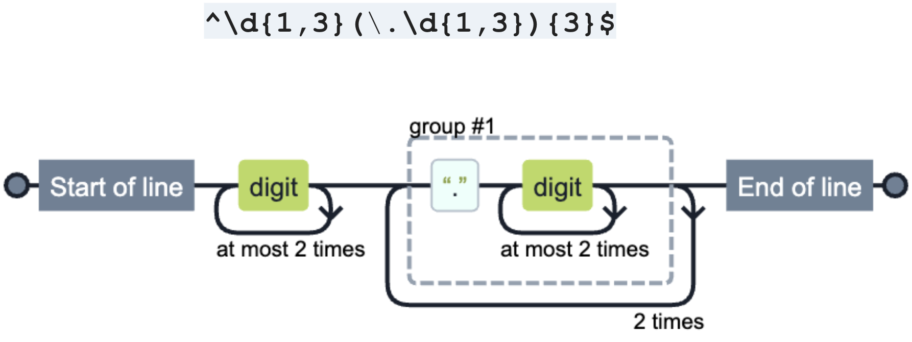

# Regular Expressions: Part 1 - Introduction

_Regular Expression is a Syntax to Define String Pattern_

[RegExp Part 1 - Introduction.pdf](./assets/RegExp Part 1 - Introduction.pdf)

## How to move on ...

### The best online books:
* https://www.regular-expressions.info/tutorial.html
* https://www.rexegg.com
### Books:
* Regular Expressions Cookbook by Jan Goyvaerts
* https://www.regular-expressions.info/books.html
### Cheat Sheet:
* https://cheatography.com/davechild/cheat-sheets/regular-expressions
### Interactive Tutorials:
* https://regexone.com
### Editors:
* RegexBuddy: https://www.regexbuddy.com _(The best RegExp IDE!)_ 💪
* Online editor: https://regex101.com
### Visualizers:
* https://ihateregex.io/playground
* https://extendsclass.com/regex-tester.html
### Other:
* XRegExp: http://xregexp.com/xregexp/api
* [My YouTube | TypeScript | RxJS | Angular | RegExp](https://www.youtube.com/channel/UCMCzIurEKzm1Oppb5ugS3qA)

## Author

| [ Anton Korniychuk](https://korniychuk.pro) |
| :---: |

| [ Timur Shemsedinov](https://github.com/tshemsedinov) |
| :---: |
